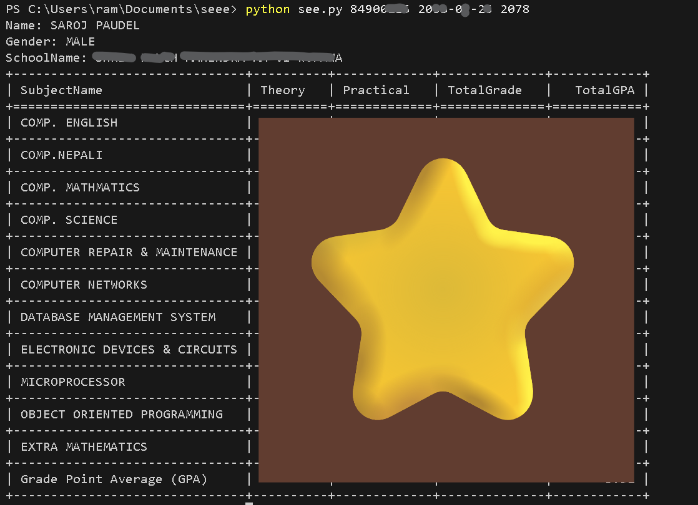

# Simple SEE result checker in CLI
 **Usage:**
 ```
python see.py <symbol_no> <dob> <academic_year>
```

**Date of Birth must be in *YYYY-MM-DD* format**


Check from SEE gov site:
http://result.see.gov.np/result

**Preview:**



**Available Years:**
2074 - 2080
